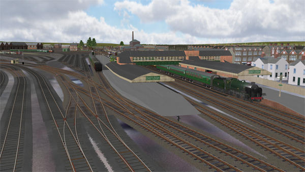

# NewForest Route V3

## Scenario

New Forest features the Bournemouth UK railway line in the 1950s and attempts to recreate the 1950s timetable using the Timetable Mode in Open Rails.

For details of the route, please read [Background.md](Background.md)

The route is a work in progress and some non-fatal errors exist, which will gradually be reduced. Some errors are an MSTS legacy, and must be tolerated.

## Compatibility

This content is compatible with Open Rails v1.4 (and not with MSTS). The content is stand-alone and only needs an Open Rails installation.

## Installing

**Highly Recommended**: Follow [these instructions](https://www.dropbox.com/s/gh2f2pko4f1houj/Using%20routes%20published%20on%20GitHub%20v2.pdf?dl=0) to benefit from using Git.

or

Quick: [Download the ZIP](https://github.com/rickloader/NewForestRouteV3/archive/refs/heads/main.zip) and unpack it.

## Legal

The route is freeware, but uses rolling stock provided by others. 
New Forest Route is the copyright of Rick Loader.
Rolling stock copyrights remain with their authors, and they have my thanks.

This work is published under the Creative Commons 4.0 International licences: 

1. The New Forest (Watersnake) route CC-BY 
2. Third party models and rolling stock CC-BY-NC-ND

Licence details are to be found at [About CC Licenses - Creative Commons](https://creativecommons.org/about/cclicenses/)